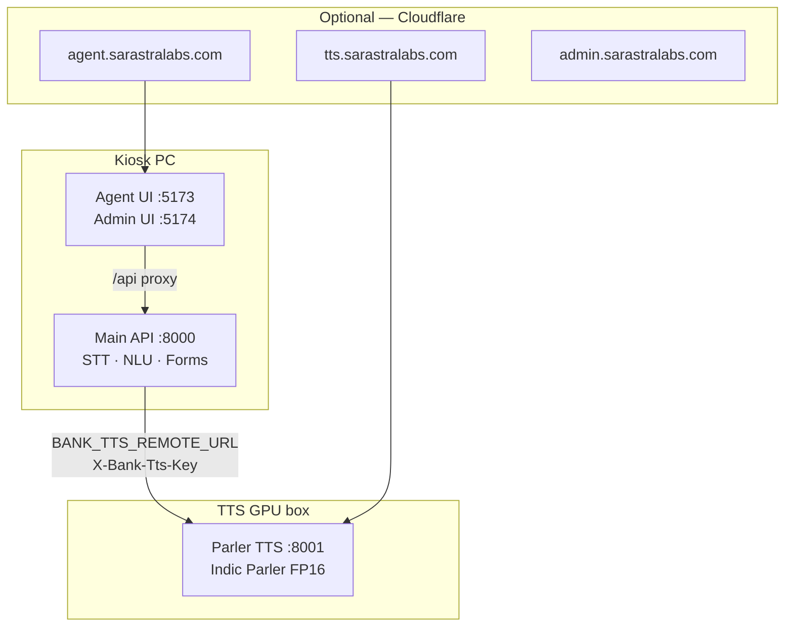

# Deployment Guide — Kannada Voice Banking

Production-style layout: **split TTS GPU box** + **kiosk PC**, or **single PC** for lab demos.

| Role | Machine | Processes | Ports |
|------|---------|-----------|-------|
| **TTS box** | 8 GB GPU PC | Parler only | `:8001` |
| **Kiosk** | Main demo PC | STT, NLU, API, UI | `:8000`, `:5173`, `:5174` |
| **Single PC** | One laptop | All of the above | `:8001` + `:8000` + UI |

---

## Architecture



**Startup order (always):** TTS box first → wait for `ready=true` → kiosk API → frontend.

Why: Parler loads ~1–2 minutes into GPU on first start. The TTS server blocks until warmed; the kiosk API waits for remote TTS before serving.

---

## One-time setup (any machine)

```powershell
cd <repo-root>   # git clone https://github.com/sarastralabs/bank_assistant.git
git pull

# Python deps (main venv — NOT .venv-parler)
py -3.12 -m pip install -r requirements.txt

# Frontend
cd frontend
npm install
cd ..

# Models + demo data (if missing)
py -3.12 scripts/deployment_check.py
```

**TTS box only** — one command:

```powershell
powershell -ExecutionPolicy Bypass -File .\scripts\setup_tts_box.ps1
# Edit .env — set BANK_TTS_REMOTE_KEY (same as kiosk)
# After model download, set TRANSFORMERS_OFFLINE=1 HF_HUB_OFFLINE=1 HF_DATASETS_OFFLINE=1
```

Or manually:

```powershell
powershell -ExecutionPolicy Bypass -File .\scripts\setup_parler_venv.ps1
copy .env.tts.example .env
```

**Kiosk only:**

```powershell
copy .env.kiosk.example .env
# Set BANK_TTS_REMOTE_URL, BANK_TTS_REMOTE_KEY, admin password
```

**Single PC:**

```powershell
copy .env.local-pc.example .env
# BANK_TTS_REMOTE_URL=http://127.0.0.1:8001
```

Generate a shared TTS secret (use same value on kiosk + TTS box):

```powershell
py -3.12 -c "import secrets; print(secrets.token_urlsafe(32))"
```

---

## Mode A — Single PC (lab / dev)

Best for one machine with a GPU. TTS runs as a separate process to avoid VRAM fights with STT.

### Terminal 1 — TTS (start first)

```powershell
cd <repo-root>
powershell -ExecutionPolicy Bypass -File .\scripts\run_tts_server.ps1
```

Wait until you see:

```text
[tts-server] Ready — speaker=Suresh phrases=… elapsed=…s
```

Health check:

```powershell
curl http://127.0.0.1:8001/api/health
# "ready": true, "status": "ready"
```

### Terminal 2 — Main API

```powershell
cd <repo-root>
powershell -ExecutionPolicy Bypass -File .\scripts\start-kiosk-api.ps1
```

This waits for TTS `ready` if `BANK_TTS_REMOTE_URL` is set, then starts `:8000`.

**Do not** activate `.venv-parler` for this terminal.

### Terminal 3 — Frontend

```powershell
cd <repo-root>\frontend
.\scripts\dev-all.ps1
```

| URL | Purpose |
|-----|---------|
| `https://127.0.0.1:5173` | Customer agent |
| `https://127.0.0.1:5174` | Admin (`admin` / password from `.env`) |
| `http://127.0.0.1:8000/api/health` | API health |

**Shortcut** — opens all 3 terminals:

```powershell
powershell -ExecutionPolicy Bypass -File .\scripts\start-local-all.ps1
```

### Verify

```powershell
py -3.12 scripts\e2e_local_check.py
powershell -ExecutionPolicy Bypass -File .\frontend\scripts\deployment_verify.ps1
```

---

## Mode B — Two machines (production / college lab)

### Machine 1 — TTS GPU box (8 GB)

**One-time setup:**

```powershell
cd <repo-root>
powershell -ExecutionPolicy Bypass -File .\scripts\setup_tts_box.ps1
```

Edit `.env` — set `BANK_TTS_REMOTE_KEY` to match kiosk. After first model download, set offline flags to `1`.

**`.env`** profile:

```env
BANK_TTS_ENGINE=parler
BANK_PARLER_DTYPE=fp16
BANK_PIPELINE_WORKER=0
BANK_TTS_ALLOW_MMS=0
BANK_TTS_REMOTE_KEY=<same-secret-as-kiosk>
```

#### Terminal 1 — Parler TTS

```powershell
cd <repo-root>
powershell -ExecutionPolicy Bypass -File .\scripts\run_tts_server.ps1
```

Wait for `[tts-server] Ready …`

#### Terminal 2 — Cloudflare tunnel (optional, for off-LAN kiosk)

```powershell
cloudflared tunnel --config %USERPROFILE%\.cloudflared\config-tts.yml run bank-tts
```

Template: `deploy/cloudflare/config-tts.yml.example`

#### Verify TTS box

```powershell
curl http://127.0.0.1:8001/api/health
curl https://tts.sarastralabs.com/api/health
```

---

### Machine 2 — Kiosk PC

**`.env`** — copy from `.env.kiosk.example`:

```env
BANK_TTS_ENGINE=auto
BANK_TTS_REMOTE_URL=https://tts.sarastralabs.com
# Same LAN (faster): BANK_TTS_REMOTE_URL=http://192.168.x.x:8001
BANK_TTS_REMOTE_KEY=<same-secret-as-TTS-box>
BANK_PIPELINE_WORKER=1
BANK_ADMIN_USER=admin
BANK_ADMIN_PASS=<strong-password>
```

#### Terminal 1 — Main API

```powershell
cd <repo-root>
powershell -ExecutionPolicy Bypass -File .\scripts\start-kiosk-api.ps1
```

#### Terminal 2 — Frontend

```powershell
cd <repo-root>\frontend
.\scripts\dev-all.ps1
```

Students on same Wi‑Fi: `https://<kiosk-ip>:5173`

#### Terminal 3 — Public UI tunnel (optional)

Only if phones are **not** on the same Wi‑Fi.

```powershell
cloudflared tunnel --config %USERPROFILE%\.cloudflared\config-kiosk.yml run bank-kiosk
```

Template: `deploy/cloudflare/config-kiosk.yml.example`

Set on kiosk `.env` if needed:

```env
BANK_CORS_ORIGINS=https://agent.sarastralabs.com,https://admin.sarastralabs.com
```

(`*.sarastralabs.com` is already allowed by default in `api/cors_config.py`.)

#### Verify kiosk

```powershell
curl http://127.0.0.1:8000/api/health
```

Expect:

```json
"status": "ok",
"tts": {
  "remote": { "healthy": true, "ready": true, "url": "https://tts.sarastralabs.com" }
}
```

```powershell
py -3.12 scripts\e2e_local_check.py
```

---

## Quick reference — terminals per machine

| Machine | Terminal 1 | Terminal 2 | Terminal 3 |
|---------|------------|------------|------------|
| **Single PC** | `run_tts_server.ps1` | `start-kiosk-api.ps1` | `frontend\scripts\dev-all.ps1` |
| **TTS box** | `run_tts_server.ps1` | `cloudflared … config-tts.yml` | — |
| **Kiosk** | `start-kiosk-api.ps1` | `frontend\scripts\dev-all.ps1` | `cloudflared … config-kiosk.yml` (optional) |

---

## Health endpoints

| Endpoint | Meaning |
|----------|---------|
| `GET :8001/api/health` | TTS service; `"ready": true` = Parler loaded + phrases cached |
| `GET :8000/api/health` | Main API; `"status": "warming"` = remote TTS not ready yet |
| `GET :8000/api/health` → `tts.remote` | Kiosk view of remote TTS |

Wait helper:

```powershell
powershell -ExecutionPolicy Bypass -File .\scripts\wait-for-tts-ready.ps1 -Url http://127.0.0.1:8001
```

---

## Environment profiles

| File | Use on |
|------|--------|
| `.env.local-pc.example` | Single PC — `BANK_TTS_REMOTE_URL=http://127.0.0.1:8001` |
| `.env.kiosk.example` | Kiosk PC — remote TTS URL |
| `.env.tts.example` | TTS GPU box only |

---

## Production checklist

- [ ] Change `BANK_TTS_REMOTE_KEY` on **both** machines (same value)
- [ ] Change `BANK_ADMIN_PASS` on kiosk
- [ ] TTS box: `BANK_PIPELINE_WORKER=0`, no `BANK_TTS_REMOTE_URL`
- [ ] Start TTS before API every time
- [ ] Run `deployment_verify.ps1` before demo
- [ ] MongoDB optional — SQLite fallback works offline
- [ ] Firewall: allow `:8000`, `:5173`, `:5174` on kiosk Private network
- [ ] Cloudflare tunnel docs: [CLOUDFLARE_TUNNEL.md](./CLOUDFLARE_TUNNEL.md)

---

## Troubleshooting

| Problem | Fix |
|---------|-----|
| First speak takes 2+ min | TTS not warmed — wait for `[tts-server] Ready`; check `:8001/api/health` |
| `remote.healthy: false` | TTS not running, wrong URL, or tunnel down |
| `remote.ready: false` | TTS still loading — wait or run `wait-for-tts-ready.ps1` |
| Speak 500 / timeout | TTS self-loop — ensure TTS `.env` has **no** `BANK_TTS_REMOTE_URL` |
| Admin “Service unavailable” | API health slow — ensure TTS ready first; MongoDB errors are OK (SQLite fallback) |
| GPU OOM | Start TTS before API; use `BANK_PARLER_DTYPE=fp16`; close other GPU apps |
| `401` on speak-kannada | `BANK_TTS_REMOTE_KEY` mismatch between kiosk and TTS box |

---

## Related docs

| Doc | Contents |
|-----|----------|
| [CLOUDFLARE_TUNNEL.md](./CLOUDFLARE_TUNNEL.md) | Tunnel setup, DNS, Windows service |
| [DEMO_AND_INTERACTION_GUIDE.md](./DEMO_AND_INTERACTION_GUIDE.md) | Demo script, test phrases |
| [deploy/cloudflare/](../deploy/cloudflare/) | Tunnel YAML templates |
