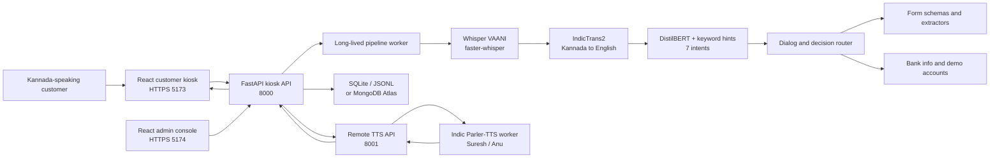
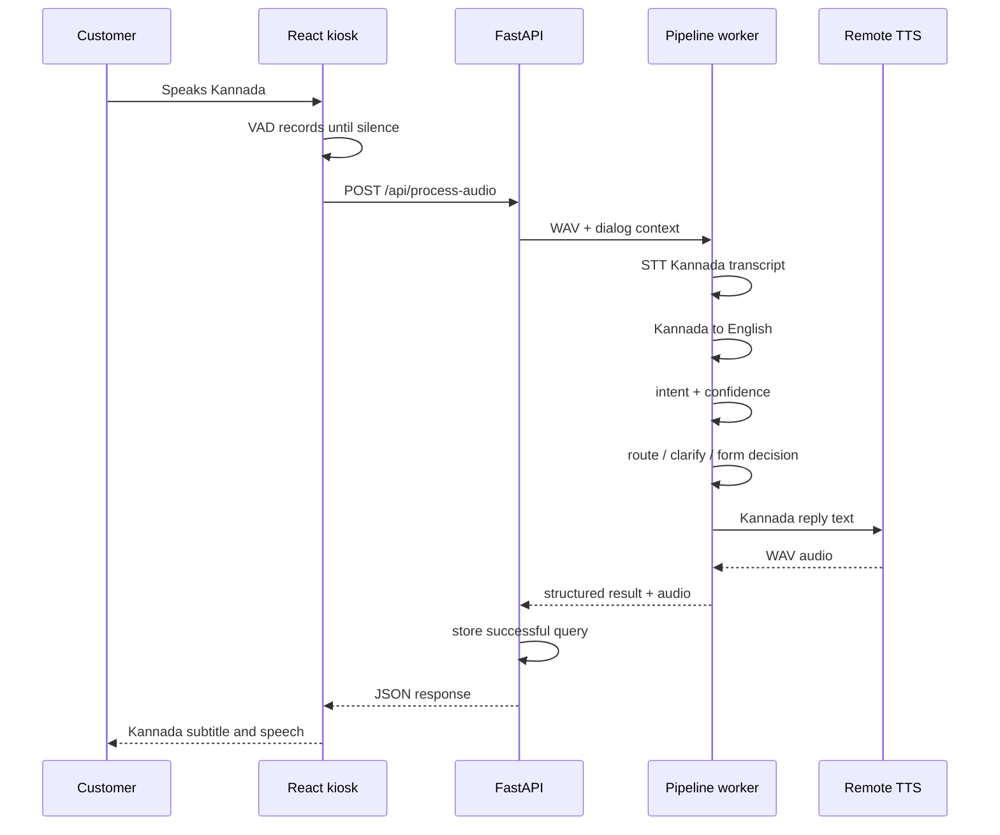

# Kannada Voice Banking Assistant

## Complete End-to-End Project Documentation

This document is the technical and product-level source of truth for the Kannada Voice Banking Assistant. It explains the problem being solved, the complete technology stack, system architecture, AI/ML pipeline, application flows, APIs, storage, setup, deployment, testing, security boundaries, limitations, and future scope.

The document reflects the current repository implementation. Older documents may describe an earlier informational-only version that used MMS-TTS as the main voice. The current system also supports voice-filled forms, a simulated balance lookup, a customer kiosk, an admin console, and remote Indic Parler-TTS.

---

## 1. Executive summary

The Kannada Voice Banking Assistant is a voice-first banking support kiosk for Kannada-speaking users who may find English banking interfaces and paper forms difficult to use.

The user speaks in Kannada. The system:

1. records the speech in the browser;
2. converts Kannada speech to Kannada text;
3. translates the text to English for intent processing;
4. identifies the banking request;
5. selects an informational answer, balance inquiry, or bank form;
6. collects required form values through Kannada voice prompts;
7. generates a Kannada spoken response;
8. displays the result or a printable English form.

The application does not connect to a real bank or core banking system. Any account balance shown is simulated from local demo data.

---

## 2. Problem statement

Many banking services in India still depend on English interfaces, written forms, branch terminology, and multi-step procedures. Kannada-speaking customers may understand the banking need but struggle to:

- describe the request in English;
- identify the correct banking form;
- type names, account numbers, amounts, and addresses;
- understand which documents or steps are required;
- navigate a conventional digital interface;
- complete a form independently at a branch.

This creates dependence on staff or other people, increases waiting time, and makes routine services less accessible.

### Formal problem statement

Design and implement a Kannada voice-based banking assistant that can understand common spoken banking requests, respond in Kannada, guide users through supported services, collect form details through speech, and generate a reviewable result without requiring a live banking integration.

---

## 3. Proposed solution

The project provides a hands-free customer kiosk and a separate staff console.

### Customer experience

- A camera detects that a customer is present.
- The assistant gives a time-based Kannada greeting.
- The customer speaks a request in Kannada.
- The assistant understands the request and responds in Kannada.
- If a form is required, it asks each field in Kannada.
- Spoken values are converted into structured English form values.
- The customer confirms the captured information.
- The completed form can be reviewed and printed.
- For balance inquiries, a demo account number is collected and matched against simulated account data.

### Staff experience

- Staff sign in to the admin console.
- Staff can open or close the kiosk lobby.
- Staff can view the current kiosk state and session status.
- Staff can select the assistant voice.
- Staff can review stored form submissions.

---

## 4. Intended users

Primary users:

- Kannada-speaking bank customers;
- customers who are not comfortable typing in English;
- elderly or low-digital-literacy users;
- users who prefer spoken assistance over form navigation.

Secondary users:

- bank counter staff;
- kiosk administrators;
- project evaluators and academic reviewers;
- developers maintaining the deployment.

---

## 5. Project objectives

### Functional objectives

- Accept spoken Kannada audio.
- Produce a Kannada transcript.
- Translate Kannada text into English.
- Classify the request into a supported banking intent.
- Handle uncertain predictions with clarification prompts.
- Maintain limited conversational context between turns.
- Provide controlled informational responses.
- Open the correct banking form.
- Collect form fields using Kannada speech.
- Normalize names, dates, account numbers, mobile numbers, amounts, and choices.
- Read captured values back in natural Kannada.
- Generate a printable English form preview.
- Perform a simulated account-balance lookup.
- Store query history and form submissions.
- Support customer and staff interfaces.
- Produce Kannada speech using a natural remote voice.

### Non-functional objectives

- Run the core language pipeline locally after model setup.
- Avoid paid LLM or speech APIs.
- Keep the decision path explainable.
- Separate incompatible AI dependencies into different environments.
- Remain usable on Windows-based lab or kiosk machines.
- Keep personal-data claims honest: no real bank access.
- Use caching and long-lived workers to reduce repeated model startup time.

---

## 6. Scope

### Included

- Kannada speech input and output.
- Seven trained banking intent classes.
- Rule-based form and follow-up routing.
- Low-confidence clarification.
- Eleven form schemas, including balance inquiry.
- Typed form-field extraction.
- Simulated balance lookup.
- Customer-presence detection.
- Kiosk session lifecycle.
- Query history.
- Form-submission history.
- Admin authentication and controls.
- Local, LAN, and optional Cloudflare deployment.
- Natural Indic Parler-TTS with Suresh and Anu voices.
- MMS-TTS and browser speech as limited fallback paths.

### Explicitly excluded

- Connection to a real core banking system.
- Real account authentication.
- OTP verification.
- Real balance, deposit, withdrawal, or transfer execution.
- Storage of real banking credentials.
- Production-grade identity verification.
- Biometric recognition.
- Legal replacement for official bank forms.
- General-purpose open-domain conversation.

---

## 7. Supported banking intents

The NLU model predicts one of seven labels:

1. `check_balance` — open the simulated balance inquiry.
2. `apply_loan` — open the retail loan application.
3. `open_account` — open the individual account-opening form.
4. `deposit_money` — open the cash or cheque deposit form.
5. `withdraw_money` — open the cash withdrawal form.
6. `account_info_query` — answer account-procedure questions.
7. `interest_rate_query` — answer supported interest-rate questions.

The router can also enter additional application modes that are not NLU labels:

- `form_menu` — list available forms;
- `form_select` — resolve a spoken form choice;
- `clarification` — ask the user to choose between likely intents.

---

## 8. Supported forms

Form definitions are stored in `data/forms.json`.

The repository currently contains:

1. Balance inquiry — simulated lookup.
2. Cash withdrawal.
3. Cash or cheque deposit.
4. Individual account opening.
5. Retail loan application.
6. RTGS or NEFT transfer.
7. Cheque-book request.
8. ATM or debit-card application.
9. Fixed-deposit application.
10. Registered mobile-number update.
11. Stop-payment request for a cheque.

The balance form is opened directly through the balance intent. The general form menu lists the remaining customer forms.

Every generated form carries a Kannada and English disclaimer stating that it is a demonstration and not an official bank document.

---

## 9. High-level architecture



---

## 10. Deployment architecture

### Recommended split deployment

The recommended deployment separates the natural TTS workload from the kiosk pipeline.

#### Kiosk machine

Runs:

- FastAPI API on port `8000`;
- STT, translation, NLU, routing, and form extraction;
- customer React application on port `5173`;
- admin React application on port `5174`;
- optional kiosk Cloudflare tunnel.

#### TTS GPU machine

Runs:

- TTS-only FastAPI service on port `8001`;
- isolated Indic Parler-TTS worker;
- optional TTS Cloudflare tunnel;
- no STT, translation, or NLU pipeline worker.

The kiosk calls the TTS machine through either:

- a LAN URL such as `http://192.168.x.x:8001`; or
- an HTTPS tunnel URL.

### Single-machine deployment

A single capable machine can run ports `8000`, `8001`, `5173`, and `5174`. This is simpler for a lab but increases GPU-memory contention.

---

## 11. Complete technology stack

### Frontend

- React `19`
- React DOM `19`
- TypeScript `5.7`
- Vite `6`
- `lottie-react` for assistant animation
- Browser MediaDevices API for microphone and camera access
- MediaRecorder API for audio capture
- Web Audio API for microphone level and voice-activity detection
- Browser FaceDetector API when supported
- Canvas frame texture and motion fallback when FaceDetector is unavailable
- Web Speech API only as a limited greeting fallback
- HTTPS development certificates for camera and microphone access from non-localhost devices

### Backend API

- Python `3.12`
- FastAPI
- Uvicorn
- Pydantic
- `python-multipart` for audio and form uploads
- `python-dotenv` for environment profiles
- Pydub, PyAV, SoundFile, and NumPy for audio conversion and processing

### Speech-to-text

- Model: `ARTPARK-IISc/whisper-medium-vaani-kannada`
- Runtime: `faster-whisper`
- Inference engine: CTranslate2
- Local converted model: `models/whisper-medium-vaani-ct2/`
- Quantized execution is used to reduce memory and improve speed.

An optional converted `openai/whisper-medium` baseline is retained for benchmarking.

### Translation

- Kannada to English: `ai4bharat/indictrans2-indic-en-dist-200M`
- English to Kannada: `ai4bharat/indictrans2-en-indic-dist-200M`
- Runtime: Hugging Face Transformers
- Pre/post-processing: IndicTransToolkit
- Tokenization: SentencePiece

The translation models are gated Hugging Face models. Their terms must be accepted before first download.

### Natural-language understanding

- Base model: `distilbert-base-uncased`
- Task: seven-class sequence classification
- Framework: PyTorch and Hugging Face Transformers
- Training and evaluation: scikit-learn
- Saved checkpoint: `models/nlu-distilbert/`
- Rule-based keyword classifier: baseline and runtime hint source
- Kannada keyword resolver: protects common requests when translation is imperfect
- Clarification logic: handles low-confidence or ambiguous requests
- Follow-up resolver: uses the previous intent and route for short follow-up questions

### Decision routing

- Pure Python deterministic logic
- Banking knowledge from `data/bank_info.json`
- Form mapping from `data/forms.json`
- Dialog context from the frontend
- No generative LLM

### Form processing

- Schema-driven forms from JSON
- STT and IndicTrans2 reused for spoken field answers
- Typed extraction for:
  - names and free text;
  - account and mobile numbers;
  - monetary amounts;
  - dates;
  - account types;
  - loan types;
  - deposit modes;
  - cheque-book leaf counts;
  - card types;
  - fixed-deposit tenure and payout.
- Kannada digit and number normalization
- Kannada form-summary generation
- Confirmation and correction handling

### Text-to-speech

Primary natural voice:

- AI4Bharat Indic Parler-TTS
- voices: Suresh and Anu
- isolated `.venv-parler` environment
- `transformers==4.46.1` in the isolated environment
- balanced dynamic audio-token budget with a legacy rollback profile
- SDPA attention and optional guarded `torch.compile`
- production CUDA/FP16 enforcement on the dedicated TTS service
- phrase and greeting caching
- per-request generation, queue, encoding, and audio-duration telemetry

The hands-free client sends `include_audio=false` to `/api/process-audio`, so it receives STT, localized Kannada response text, and routing before requesting TTS separately. Recognized text and the selected action therefore appear without waiting for remote audio generation, and the STT worker is free for subsequent work. The multipart flag defaults to `true`, preserving audio responses for existing scripts and other API clients.

Fallback voice:

- `facebook/mms-tts-kan`
- Hugging Face `VitsModel`
- runs from the main Python environment
- intended for local fallback, not the normal remote-kiosk path

Browser fallback:

- Web Speech API may be used for a greeting if API TTS is unavailable and a Kannada browser voice exists.

### Persistence

Default local storage:

- SQLite at `data/history.db` for query history;
- WAV history under `data/history_audio/`;
- JSON Lines at `data/form_submissions.jsonl` for form submissions.

Optional remote storage:

- MongoDB Atlas through PyMongo;
- collections for query history, form submissions, and kiosk sessions.

### Testing and tooling

- Pytest
- Python `unittest` compatibility in selected tests
- TypeScript compiler
- Vite production build
- JiWER for STT metrics
- SacreBLEU for translation metrics
- scikit-learn metrics
- Seaborn for confusion matrices
- deployment, smoke-test, and end-to-end scripts under `scripts/`

---

## 12. AI model ownership and training

### Pretrained models used without retraining

- Whisper VAANI Kannada STT model
- IndicTrans2 Kannada-to-English model
- IndicTrans2 English-to-Kannada model
- Indic Parler-TTS
- Facebook MMS-TTS Kannada

These models are downloaded and executed by the project. They were trained by their original publishers.

### Model trained by this project

The project fine-tunes DistilBERT for banking-intent classification.

Training source:

- `data/nlu_training_data.json`
- 301 labeled English examples
- six intents contain 42 examples each
- `account_info_query` contains 49 examples

Why the data is in English:

- Kannada speech is first transcribed;
- the transcript is translated to English;
- NLU therefore receives English or translation-like English.

Training process:

1. Load and validate the labeled dataset.
2. Create stratified train, validation, and test splits.
3. Tokenize using the DistilBERT tokenizer.
4. Fine-tune a seven-label classification head.
5. track validation accuracy;
6. save the best checkpoint;
7. compare the trained model with the keyword baseline.

Verified saved evaluation artifacts report:

- keyword baseline accuracy: `60.9%`;
- fine-tuned DistilBERT accuracy: `97.8%`;
- fine-tuned macro F1: `0.979`;
- evaluation support: `46` test examples.

These figures describe the stored project evaluation split, not production accuracy on every speaker, microphone, or dialect.

---

## 13. End-to-end voice-query flow



### Detailed processing

1. The frontend warms the microphone when the conversation begins.
2. Energy-based voice-activity detection waits for speech.
3. Recording stops after configurable silence.
4. The API validates and converts the uploaded audio to WAV.
5. The long-lived worker performs STT.
6. Kannada text is translated to English.
7. Direct form-menu and follow-up rules are checked.
8. The NLU resolver combines DistilBERT, English hints, and Kannada keyword evidence.
9. Low-confidence results produce a clarification question.
10. The decision router selects a controlled answer or form.
11. Kannada reply text is synthesized.
12. The response includes transcripts, intent, confidence, route, timing, optional form information, and Base64 WAV audio.
13. Successful turns are persisted.

---

## 14. Voice-form flow

1. A transactional intent or spoken form name selects a form.
2. The frontend requests the form schema.
3. Kannada prompt audio is fetched or synthesized and cached.
4. Auto fields such as the current date are filled automatically.
5. For each remaining field:
   - the Kannada prompt is spoken;
   - VAD records one answer;
   - STT produces Kannada text;
   - IndicTrans2 produces English text;
   - a typed extractor produces a clean form value;
   - the value is shown and, for most field types, read back;
   - the user confirms or repeats most values.
6. The backend generates a Kannada summary.
7. The user confirms the complete form.
8. The submission is persisted.
9. An English form preview is shown for printing or PDF export.

Name fields currently advance without individual voice confirmation to avoid repeated recognition loops. Rejecting the final whole-form summary restarts collection from the first field; selecting one completed field for correction is planned but not yet implemented.

The form is a demonstration artifact. It does not submit data to a bank.

---

## 15. Balance-inquiry flow

1. `check_balance` opens `balance_inquiry`.
2. The assistant asks for an account number.
3. Digits are extracted from the spoken answer.
4. At least eight digits are required.
5. The API queries `data/demo_accounts.json`.
6. A matching demo account returns a simulated holder and balance.
7. Unknown or invalid numbers are rejected and requested again.
8. Account digits and money are spoken in Kannada words.

No external bank is queried.

---

## 16. Kiosk and presence flow

Kiosk phases:

- `stopped` — staff has closed the service;
- `idle` — waiting for a customer;
- `greeting` — greeting is being played;
- `conversation` — hands-free interaction is active;
- `ended` — a session has completed.

Presence detection:

- uses the browser FaceDetector API when available;
- otherwise uses center-frame texture and motion heuristics;
- does not identify a person;
- does not store facial images;
- automatically starts a greeting after presence is stable;
- ends abandoned sessions after a configured absence period;
- suppresses automatic ending while a form is active.

---

## 17. API reference

All kiosk API routes are under `/api`.

### Health

- `GET /api/health/live` — lightweight API liveness.
- `GET /api/health` — API, persistence, pipeline, and TTS status.

### Main voice pipeline

- `POST /api/process-audio` — complete STT, translation, NLU, route, and TTS flow.
- `POST /api/transcribe-audio` — STT and translation without full routing.
- `POST /api/speak-kannada` — synthesize Kannada text.

### Balance

- `GET /api/balance/{account_number}` — simulated balance lookup.

### Forms

- `GET /api/forms` — form catalog.
- `GET /api/forms/menu` — numbered spoken form menu.
- `GET /api/forms/{form_id}` — complete form schema.
- `GET /api/forms/{form_id}/prompt-audio` — cached Kannada prompt audio.
- `POST /api/forms/{form_id}/summary` — Kannada read-back summary.
- `POST /api/forms/resolve-choice` — resolve a spoken form choice.
- `POST /api/forms/fill-field` — speech-to-structured field value.
- `POST /api/forms/transcribe` — legacy form transcription path.
- `POST /api/forms/submit` — persist a completed demo form.
- `GET /api/forms/submissions` — list recent submissions.

### Kiosk

- `GET /api/kiosk/status`
- `GET /api/kiosk/status/lite`
- `POST /api/kiosk/start`
- `POST /api/kiosk/stop`
- `POST /api/kiosk/presence`
- `POST /api/kiosk/session/begin`
- `POST /api/kiosk/session/phase`
- `POST /api/kiosk/session/end`
- `POST /api/kiosk/session/end-admin`
- `GET /api/kiosk/greetings`
- `GET /api/kiosk/greet-audio`

### History

- `GET /api/history`
- `GET /api/history/{item_id}`
- `DELETE /api/history/{item_id}`
- `DELETE /api/history`

### Admin

- `POST /api/admin/login`
- `GET /api/admin/me`
- `POST /api/admin/logout`
- `GET /api/admin/settings/voice`
- `PUT /api/admin/settings/voice`

### Landing data

- `GET /api/landing`

### TTS-only server

The TTS GPU service exposes:

- `GET /api/health/live`
- `GET /api/health`
- `POST /api/speak-kannada`

The TTS synthesis route validates `X-Bank-Tts-Key` when `BANK_TTS_REMOTE_KEY` is configured. A non-empty key is required for every shared or public deployment.

Authentication coverage is intentionally limited in the current demonstration. Admin settings and staff kiosk-control routes require an admin bearer token, but the main voice pipeline, balance, form processing, form-submission listing, history, and customer session routes are not protected.

---

## 18. Worker and memory design

The project uses a long-lived pipeline subprocess by default.

Why:

- model imports are expensive;
- repeated process creation increases latency;
- AI dependencies can produce noisy output;
- model crashes should not terminate the FastAPI host;
- worker restart gives a controlled recovery path.

The bridge:

- starts `run_pipeline_worker.py`;
- communicates using JSON Lines over standard input and output;
- ignores non-JSON runtime noise;
- retries after a broken worker;
- falls back to a one-shot subprocess when required.

Important environment controls:

- `BANK_PIPELINE_WORKER`
- `BANK_PIPELINE_KEEP_LOADED`
- `BANK_NLU_MIN_CONF`
- `BANK_NLU_MAX_CLARIFY`

Parler-TTS uses a separate worker and virtual environment because its Transformers version conflicts with the newer version required by IndicTrans2.

---

## 19. Repository structure

```text
api/
  main.py                  FastAPI kiosk application
  tts_main.py              TTS-only FastAPI application
  routes/                  HTTP route modules
  kiosk_state.py           kiosk and session state
  history.py               SQLite history implementation
  forms_catalog.py         form-schema loader

backend/
  pipeline.py              end-to-end AI orchestration
  pipeline_bridge.py       long-lived worker bridge
  dialog_context.py        multi-turn context model
  stt/                     Whisper / faster-whisper
  translation/             IndicTrans2 wrappers
  nlu/                     intent model, hints, clarification, follow-up
  decision_router/         controlled banking responses
  forms/                   extraction, menu, digits, Kannada summaries
  tts/                     remote Parler bridge, MMS fallback, caching
  db/                      MongoDB and local persistence facade

frontend/
  src/App.tsx              customer application entry
  src/AdminApp.tsx         staff application entry
  src/components/          kiosk, conversation, forms, admin, history
  src/hooks/               VAD, presence, recorder, pipeline hooks
  src/utils/               audio, commands, Kannada values, API helpers
  scripts/                 HTTPS and dev-server helpers

data/
  nlu_training_data.json   custom intent dataset
  bank_info.json           controlled informational knowledge
  forms.json               bilingual form schemas
  demo_accounts.json       simulated balance data
  greetings/               generated greeting WAV cache
  history.db               local query history, generated

models/
  whisper-medium-vaani-ct2/
  whisper-medium-ct2/
  nlu-distilbert/

scripts/
  setup and deployment helpers
  server start scripts
  Cloudflare helpers
  deployment and smoke checks
  greeting-cache generator

tests/
  backend unit and flow tests
```

---

## 20. Environment profiles

Never commit a real `.env`.

### Kiosk profile

Copy `.env.kiosk.example` to `.env`.

Key behavior:

- pipeline worker enabled;
- remote TTS URL configured;
- MMS fallback disabled for the remote deployment;
- same shared TTS key as the GPU box;
- admin password changed from the example value;
- offline model flags enabled after setup.

### TTS GPU profile

Copy `.env.tts.example` to `.env`.

Key behavior:

- Parler is the selected engine;
- pipeline worker disabled;
- no `BANK_TTS_REMOTE_URL`, preventing the server from calling itself;
- sampling enabled for complete sentences;
- shared TTS key matches the kiosk;
- model download flags enabled only during initial setup.

### Single-PC profile

Copy `.env.local-pc.example` to `.env`.

The main API calls the local TTS service on port `8001`.

### Important variables

- `BANK_API_PORT`
- `BANK_TTS_PORT`
- `BANK_TTS_ENGINE`
- `BANK_TTS_SPEAKER`
- `BANK_RUNTIME_SETTINGS_FILE`
- `BANK_TTS_ALLOW_MMS`
- `BANK_PARLER_DEVICE`
- `BANK_PARLER_REQUIRE_CUDA`
- `BANK_PARLER_ATTN_IMPLEMENTATION`
- `BANK_PARLER_COMPILE`
- `BANK_PARLER_MAX_NEW_TOKENS`
- `BANK_PARLER_MIN_NEW_TOKENS`
- `BANK_PARLER_TOKENS_PER_CHAR`
- `BANK_TTS_CONCURRENCY`
- `BANK_TTS_QUEUE_TIMEOUT`
- `BANK_TTS_REMOTE_URL`
- `BANK_TTS_REMOTE_KEY`
- `BANK_TTS_REMOTE_TIMEOUT`
- `BANK_TTS_REMOTE_RETRIES`
- `BANK_PIPELINE_WORKER`
- `BANK_PIPELINE_KEEP_LOADED`
- `BANK_NLU_MIN_CONF`
- `BANK_NLU_MAX_CLARIFY`
- `BANK_ADMIN_USER`
- `BANK_ADMIN_PASS`
- `BANK_CORS_ORIGINS`
- `MONGODB_URI`
- `MONGODB_DB_NAME`

`BANK_TTS_REMOTE_TIMEOUT` defaults to 90 seconds. Zero or an invalid value also falls back to 90 seconds so an interactive request cannot wait forever. Use `none` or `inf` only for an intentional unlimited development wait.

`BANK_TTS_SPEAKER` supplies the initial voice. A voice selected in the admin panel takes effect immediately for greetings, form prompts, pipeline replies, and remote TTS requests. The selection is saved in `data/runtime_settings.json`, survives an API restart, and is synchronized with the long-lived pipeline worker. `BANK_RUNTIME_SETTINGS_FILE` can override that runtime file location.

---

## 21. Installation

### Prerequisites

- Windows 10 or 11
- PowerShell 5.1 or newer
- Python 3.12
- Node.js 18 or newer
- Git, including Git support used by `pip install git+https://...`
- FFmpeg available to Pydub when conversion requires it
- Microsoft C++ Build Tools for selected Python packages on Windows
- approximately 16 GB system RAM recommended for the kiosk pipeline
- NVIDIA GPU with approximately 8 GB VRAM recommended for natural Parler-TTS
- Hugging Face account and accepted IndicTrans2, VAANI Whisper, and Indic Parler model terms as applicable

### Automated kiosk setup

From the repository root:

```powershell
.\setup.bat
```

or:

```powershell
powershell -ExecutionPolicy Bypass -File .\scripts\setup_new_pc.ps1
```

Useful setup options:

```powershell
.\setup.bat --fresh
.\setup.bat --skip-models
```

### Manual dependency setup

```powershell
py -3.12 -m venv .venv
.\.venv\Scripts\Activate.ps1
python -m pip install --upgrade pip
pip install -r requirements.txt
pip install IndicTransToolkit --no-build-isolation
cd frontend
npm install
```

### Hugging Face preparation

Accept the model terms for both IndicTrans2 models, then authenticate for the first download:

```powershell
huggingface-cli login
```

### Model preparation

```powershell
python backend\stt\convert_models.py --model specialized
python backend\nlu\train.py
```

Large model directories are intentionally excluded from Git and must be downloaded, generated, or copied separately.

---

## 22. Running the system

### Recommended split deployment

Start in this order.

#### On the TTS GPU machine

```powershell
powershell -ExecutionPolicy Bypass -File .\scripts\run_tts_server.ps1
```

If public tunneling is used:

```powershell
cloudflared tunnel --config "$env:USERPROFILE\.cloudflared\config-tts.yml" run bank-tts
```

Verify the configured TTS health URL before continuing.

#### On the kiosk machine

```powershell
powershell -ExecutionPolicy Bypass -File .\scripts\start-kiosk-api.ps1
```

In another terminal:

```powershell
cd frontend
.\scripts\dev-all.ps1
```

Local interfaces:

- customer: `https://127.0.0.1:5173`
- admin: `https://127.0.0.1:5174`

Accept the development-certificate warning once.

#### Optional public kiosk tunnel

```powershell
powershell -ExecutionPolicy Bypass -File .\scripts\run-kiosk-tunnel.ps1
```

### Single-PC start

After selecting `.env.local-pc.example`:

```powershell
powershell -ExecutionPolicy Bypass -File .\scripts\start-local-all.ps1
```

---

## 23. Static speech cache

Greeting text lives in `backend/greetings.py`.

Generated WAV files live in `data/greetings/` and are not source-of-truth text.

The TTS service startup loads the Parler model and runs one short synthesis check. It does not block HTTP startup while generating every phrase. The canonical privacy-safe registry in `backend/tts/static_phrases.py` includes greetings, form questions, confirmation prompts, and validation messages. Static clips are cached separately for Suresh and Anu under `data/tts_cache/`; speech containing names, account numbers, balances, or captured form values remains memory-only.

Warm all fixed speech for both voices in the background after remote TTS is ready:

```powershell
powershell -ExecutionPolicy Bypass -File .\scripts\warm-static-tts.ps1 -Background
```

Progress is written to `data/logs/static-tts-warm.log`. This deployment task is safe to rerun because completed cache entries are skipped.

Generate the first greeting for each time slot:

```powershell
py -3.12 scripts\warm_greetings.py --remote --force --first-only
```

Generate every variant:

```powershell
py -3.12 scripts\warm_greetings.py --remote --force
```

The remote TTS server and tunnel must be healthy before running these commands.

After deploying TTS telemetry, benchmark cached and uncached speech for both voices:

```powershell
py -3.12 scripts\benchmark_tts_latency.py --repeats 3 `
  --output data\logs\tts-benchmark.json `
  --audio-dir data\logs\tts-benchmark-audio
```

Listen to the generated WAV files before accepting a faster profile. Check for complete sentences, correct Kannada pronunciation, natural pacing, and stable Suresh/Anu identity. If any long sentence is clipped, restore the legacy `1800/320/45` token profile.

Whenever greeting text changes, regenerate the affected WAV files; otherwise the application may continue playing stale speech.

---

## 24. Build and test commands

Pytest and HTTPX are test-only tools but are not currently declared in `requirements.txt`. Install them once in the development environment:

```powershell
.\.venv\Scripts\python.exe -m pip install pytest httpx
```

### Backend tests

```powershell
.\.venv\Scripts\python.exe -m pytest tests -q
```

### Focused language and flow tests

```powershell
.\.venv\Scripts\python.exe -m pytest tests\test_form_summary.py tests\test_balance_lookup.py tests\test_clarification_flow.py -q
```

### Frontend build

```powershell
cd frontend
npm run build
```

### Python syntax and form JSON

```powershell
python -m compileall -q api backend
python -c "import json; json.load(open('data/forms.json', encoding='utf-8')); print('OK')"
```

### Deployment verification

```powershell
py -3.12 scripts\deployment_check.py
py -3.12 scripts\deployment_check.py --full
```

### Running-stack smoke test

After TTS, API, and both frontends are running:

```powershell
.\.venv\Scripts\python.exe scripts\production_smoke_test.py --api http://127.0.0.1:8000
```

### Local end-to-end checks

```powershell
py -3.12 scripts\e2e_local_check.py
```

The current `e2e_local_check.py` contains a legacy demo login assumption and may fail after credentials are correctly rotated. Prefer the deployment check and `scripts\production_smoke_test.py` until that script is updated.

The full voice experience must also be tested manually with the actual microphone, camera, browser, kiosk API, and TTS deployment.

---

## 25. Error handling and resilience

The implementation includes:

- empty-upload validation;
- structured HTTP errors for validation and conversion failures;
- worker restart after broken pipes or worker death;
- one-shot subprocess fallback;
- low-confidence clarification;
- repeated listening after silence;
- required-field validation;
- explicit confirmation before form submission;
- account-number validation and retry;
- remote-TTS retry for network failures;
- finite remote and worker TTS timeouts;
- single-flight synthesis for concurrent duplicate requests;
- persistent versioned caching for static prompts and greetings;
- one-ahead form and summary audio prefetch;
- health and liveness routes;
- MongoDB fallback to local persistence;
- browser greeting fallback when service TTS is unavailable.

Operational health states include `ok`, `warming`, and `degraded`.

---

## 26. Security and privacy

### Current protections

- `.env` files are excluded from normal source control.
- The TTS API supports a shared secret header.
- Admin routes use bearer tokens.
- Admin tokens expire after 12 hours.
- CORS origins are configurable.
- HTTPS is supported for local camera and microphone access.
- Camera frames are processed in the browser and are not stored.
- The project does not connect to a real bank.
- Demo forms include disclaimers.

### Important limitations

- Admin authentication is demo-grade and stored in server memory.
- Default example credentials must be changed.
- The shared TTS key is not a replacement for full service identity or key rotation.
- Local query history may contain transcripts and audio.
- Form submissions may contain full entered values, including account numbers, phone numbers, PAN, addresses, dates of birth, and financial amounts.
- Query-history listing, detail, deletion, and clearing are not admin-protected.
- Form-submission listing is admin-protected, but submitted values still require a formal retention and encryption policy before real deployment.
- Main pipeline, balance, and customer kiosk-session routes are not authenticated.
- Public speech-synthesis routes can consume substantial GPU resources without rate limiting.
- Admin login has no rate limiting or account lockout.
- Some exception details are returned to clients and can expose internal information.
- Public deployment requires access controls, retention rules, encryption, audit logging, and legal review.
- Real account numbers or personal information should not be used in demonstrations.

---

## 27. Known limitations

- Speech accuracy depends on microphone quality, accent, noise, and speaking pace.
- Translation errors can affect downstream intent classification.
- The NLU domain is limited to seven trained intent labels.
- General account-procedure questions may still require more detailed entity extraction.
- Form extraction uses deterministic rules, not a general language model.
- Name and address transliteration can require manual correction.
- The balance feature is simulated.
- Parler-TTS requires a compatible GPU environment and has significant first-load latency.
- Cloudflare tunnel availability affects remote TTS when a public URL is used.
- Browser FaceDetector support varies; the scene fallback can produce false presence events.
- Long spoken forms can be tiring without field-specific final correction.
- Most fields are confirmed individually, but names currently are not.
- Rejecting the final form summary restarts all fields instead of correcting only one selected field.
- The current admin authentication is not production-grade.
- MongoDB history currently does not persist query audio.
- There is no checked-in CI workflow, container definition, or cross-platform deployment configuration.
- The current Vite preview helper is not a hardened production server and has inconsistent HTTPS assumptions; use the documented development/demo flow only until it is corrected.

---

## 28. Future improvements

### Near-term

- Add field-specific correction after final form review.
- Add browser-level automated tests for voice-form state transitions.
- Add a repeat-prompt voice command.
- Improve name and address transliteration.
- Add stronger account-number length rules per form.
- Move FastAPI startup and shutdown hooks to lifespan handlers.
- Improve tunnel and TTS readiness monitoring.
- Stop tracking generated frontend build assets if deployment does not require them.

### Medium-term

- Add Kannada-first intent training to reduce translation dependence.
- Add domain entity recognition for account services.
- Add speaker-independent STT evaluation across dialects and age groups.
- Add form progress recovery after browser refresh.
- Add accessible touch controls alongside hands-free interaction.
- Add staff-assisted correction.
- Add encrypted local storage and retention controls.

### Production path

- Integrate a bank-approved identity and consent flow.
- Keep customer profiles, authentication identities, and account data as separate models with opaque stable IDs.
- Access balances through an authenticated `AccountInquiryGateway`; never query a core-banking database directly from the kiosk or use an account number as authentication.
- Put form definitions behind a repository with immutable published versions, schema hashes, effective dates, and server-side validation.
- Bind every submission to its form version, customer/session authorization, idempotency key, retention deadline, and audit event.
- Select one authoritative datastore at startup and fail closed in production instead of silently splitting writes across MongoDB, SQLite, and JSONL.
- Use secure bank APIs through an audited backend.
- Add OTP or multi-factor authentication.
- Apply role-based access control.
- Store secrets in a managed secret vault.
- Encrypt data at rest and in transit.
- Add immutable audit logs.
- Perform security, privacy, accessibility, and regulatory reviews.
- Replace demo forms with bank-approved schemas.

---

## 29. Key design decisions

### Why a staged pipeline instead of an LLM?

- each stage is explainable;
- intent labels are controlled;
- no paid API is required;
- hallucination risk is reduced;
- the system can operate offline after setup;
- failures can be diagnosed by stage.

### Why translate before NLU?

- DistilBERT is trained on English banking phrases;
- English banking terminology is easier to label consistently;
- IndicTrans2 gives one reusable representation for the classifier.

### Why combine ML and rules?

- DistilBERT handles language variation;
- Kannada keywords protect common requests;
- rules enforce safe routes and form choices;
- clarification handles uncertainty.

### Why split TTS into another environment?

- Parler-TTS requires an older Transformers version;
- IndicTrans2 requires a newer Transformers version;
- separate environments prevent dependency breakage;
- a dedicated GPU box avoids kiosk GPU-memory contention.

### Why use a demo balance?

- it demonstrates a multi-turn account-number flow;
- it avoids false claims of real bank access;
- it allows deterministic testing;
- it keeps the academic system safe.

---

## 30. Suggested demonstration sequence

1. Open the admin console.
2. Start the lobby.
3. Open the customer screen.
4. Stand in front of the camera.
5. Listen to the Kannada greeting.
6. Ask for an account balance.
7. Speak a documented demo account number.
8. Show the simulated balance response.
9. Ask to open a bank account or apply for a loan.
10. Answer form fields in Kannada.
11. Demonstrate field confirmation.
12. Review the Kannada summary.
13. Show the printable English form.
14. Open the admin submission history.
15. Explain that no live bank system was contacted.

---

## 31. Short viva explanation

> We built a Kannada voice-first banking kiosk for users who may not be comfortable with English forms. The browser records Kannada speech and sends it to a FastAPI backend. A VAANI Kannada Whisper model performs speech recognition, IndicTrans2 translates the transcript to English, and our fine-tuned DistilBERT model predicts one of seven banking intents. A deterministic router selects an informational response or opens a schema-driven banking form. Form answers are collected by voice, translated, normalized, confirmed, and converted into a printable English form. Kannada output is spoken using Indic Parler-TTS on a separate GPU service. The system also includes camera-based presence detection, an admin console, history storage, and a simulated balance lookup. It does not connect to a real bank; only the DistilBERT intent classifier is trained by this project.

---

## 32. Related documents

- `README.md` — quick project overview and startup.
- `docs/DEPLOYMENT.md` — detailed machine-by-machine deployment.
- `docs/CLOUDFLARE_TUNNEL.md` — optional public tunnel configuration.
- `docs/WHAT_TO_SPEAK.md` — demonstration speech examples.
- `docs/DEMO_AND_INTERACTION_GUIDE.md` — demonstration operations.
- `docs/VOICE_FORM_UX_PLAN.md` — voice-form UX decisions and status.
- `backend/stt/README.md` — STT details.
- `backend/translation/README.md` — translation details.
- `backend/decision_router/README.md` — router behavior.
- `backend/tts/README.md` — TTS behavior.

---

## 33. Documentation maintenance rules

Update this document when:

- an intent is added or removed;
- a form schema changes;
- a model or model version changes;
- deployment ports or scripts change;
- storage behavior changes;
- API routes change;
- the demo/production boundary changes;
- evaluation metrics are regenerated.

Never add real passwords, access tokens, TTS keys, customer data, or private account details to this document.

